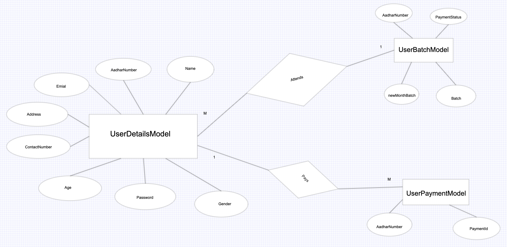

# Yoga-classes

## Technology and features Used
* Used Express.js as backend server.
* Mongo DB as Database which is hosted on cloud (Mongodb atlas).
* Also hosted app on AWS.
* Used proper MVC pattern for development.
* Also used proper Authentication using JWT token.


## API Used 
### User Registration
```
api :- 13.115.124.9:3000/api/yoga/registerUser
```
* request type :- post 
* expected Json in request :-
```
{   
    "name" : "harsh sharma",
    "age" : 19,
    "emailId" : "harshjmhr@gmail.com",
    "address" : {
        "city" : "indore",
        "state" : "M.P.",
        "country" : "India"
    },
    "contactNumber" : "7869022203",
    "gender" : "male",
    "aadharNumber" : "756474839283",
    "password" : "harsh"
}
```


### User Login 
```
13.115.124.9:3000/api/yoga/loginUser
```
* request type :- post 
* expected Json in request :-
```
{   
    "aadharNumber" : "756474839283",
    "password" : "harsh"
}
```


### Selection of batch slot 
```
13.115.124.9:3000/api/yoga/addSlot
```
* request type :- post 
* expected Json in request :-
```
{   
    "aadharNumber" : "756474839283",
    "batch" : "7-8AM"
}
```


### Change Slot Next Month
```
13.115.124.9:3000/api/yoga/addSlot
```
* request type :- post 
* expected Json in request :-
```
{   
    "aadharNumber" : "756474839283",
    "batch" : "7-8AM"
}
```

### Payment 
```
13.115.124.9:3000/api/yoga/completePayment
```
* request type :- post 
* expected Json in request :-
```
{   
    "aadharNumber" : "756474839283",
}
```

### Change Slot Next Month
* This API is only for Admin which is called for shifting people to their changed batch.
* we can trigger time based api from postman.
```
13.115.124.9:3000/api/yoga/endMonthCall
```

## Tables ans ER - Diagram
we have used 3-tables which are UserDetailsModel, UserBatchModel and PaymentModel.

### Tables
```c

+-------------------+
|  UserDetailModel  |
+-------------------+
| - name            |
| - gender          |
| - age             |
| - aadharNumber    |
| - contactNumber   |
| - emailId         |
| - address         |
| - password        |
| - token           |
+-------------------+

+-------------------+
|   PaymentModel    |
+-------------------+
| - aadharNumber    |
| - paymentId       |
+-------------------+

+-------------------+
|   UserBatchModel  |
+-------------------+
| - aadharNumber    |
| - batch           |
| - newMonthBatch   |
| - paymentStatus   |
+-------------------+


```
### ER - Diagram

  

